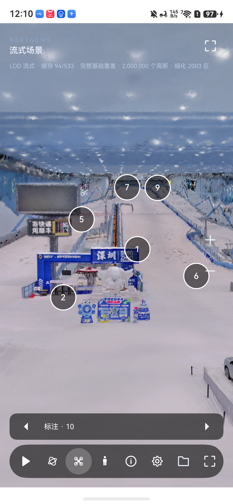

# SZTV 线上 3DGS 项目与 CDN 接口

2026-09-16 从用户提供的 [线上平台](https://www.sztv.com.cn/h5/3dgs/#/) 浏览器实际资源列表捕获，
并以公开前端的 `useYszSdk-DKoHCk62.js`、`HomeView-BIohDXxp.js` 和 `player/index.js` 核对。
读取了三页列表及全部 **49 个项目详情**；匿名 GET 均成功，无需复用浏览器账号或令牌。
只读取 API 和 JSON 元数据，没有批量下载模型、纹理、体素二进制，也未改变线上资源。

## 接口

```http
GET https://sztvbmsapi.sztv.com.cn/api/gaussian/model/list?pageNum=1&pageSize=20
GET https://sztvbmsapi.sztv.com.cn/api/gaussian/model/detail/{modelId}
```

列表返回 `{ total, rows, code, msg }`，详情返回 `{ code, msg, data }`。
列表分页字段 `pageNum`、`pageSize`；标题搜索参数为 `modelTitle`（来自首页实际代码）。
`modelId` 是长整数字符串，应原样保留，不能先转为 JavaScript Number。
浏览详情可能增加网站浏览计数，采集脚本会缓存已有响应，避免反复调用。

```bash
curl 'https://sztvbmsapi.sztv.com.cn/api/gaussian/model/list?pageNum=1&pageSize=20'
curl 'https://sztvbmsapi.sztv.com.cn/api/gaussian/model/detail/2095135795485462530'
python3 scripts/harmonyos/inspect_cdn_catalog.py --out artifacts/harmonyos/cdn-discovery-new
```

脚本最多 4 个并发，只取 JSON，单响应上限 32 MiB；原始返回及完整配置存入本地输出目录。
本次可复用目录为 `artifacts/harmonyos/cdn-discovery-20260916`。
精简的全项目地址索引见 [cdn-catalog-20260916.json](cdn-catalog-20260916.json)。

## 播放器字段映射

| 场景 | 内容 | Viewer 配置 | 碰撞 |
| --- | --- | --- | --- |
| `modelType=default`，35 个 | `modelFileUrl`，均为 `.sog` | `modelSetting`，JSON 字符串/对象 | 播放器外部传入 `collisionUrl`，不是默认读取 `lodBin` |
| `modelType=lod`，14 个 | `lodMeta` | 请求 `lodSettings` | `lodBin` 被赋给播放器 `collisionUrl` |

实际 iframe 入口：`https://www.sztv.com.cn/h5/3dgs/player/?id={modelId}&env=prod`。
业务播放器先请求详情，再选择上述资源；并支持 `budget`、`fullload`、`webgl`、`noanim`、`nofx` 等查询开关。
本次没有确认线上构建与固定官方 v1.31.2 是同一个提交，不能仅凭相同字段就认定代码完全一致。

49 份配置均通过当前 `parseViewerSettings` 主机解析。此结果仅证明配置可读，
不证明动画、所有后处理或模型在两条原生后端已经等价渲染。

## 前海冰雪世界与接入差异

项目 ID：`2095135795485462530`。

- [镜头/标注配置](https://exhibition-1253925857.cos.ap-guangzhou.myqcloud.com/sk-lod/huafa1/viewer-settings.json)：1 个默认镜头、10 个标注。
- [流式入口](https://exhibition-1253925857.cos.ap-guangzhou.myqcloud.com/sk-lod/huafa1/streamed/lod-meta.json)：9 档 LOD，532 个分块清单，另有 `env/meta.json`。`count` 为跨 LOD 数据总数，不能当作同时绘制数量。
- [体素清单](https://exhibition-1253925857.cos.ap-guangzhou.myqcloud.com/sk-lod/huafa1/v24-tiled/voxel-tiles.json)：实际 **32 块**，与已批准的验收数据选择一致。

14 个流式项目的 `filenames` 全部指向 JSON 分块清单，不是现有本地测试包中的 `.sog` ZIP。
每个项目还抽查了一个实际分块 JSON；后续需按其纹理引用加载 SOG 分量。
当前 `StreamSession` 主路径消费 `scene.json` 中的 `chunk-XXXX.sog/ply`，因此 CDN 原始
`lod-meta.json → meta.json + WebP` 需要明确适配，不能只改扩展名或将清单直塞现接口就宣称完成。
应保留真实层级/AABB/环境、配置世界坐标及版本化选择，不改写源数据。

另有 5 个字段带前导空格：3 个 `lodBin`、2 个 `lodSettings`。浏览器 URL 解析会规整这些空白，
鸿蒙接入也应只在请求时 trim，保留原始记录；规整后 JSON 均可读取。
“大运”的根清单约 9.52 MB，首次超过采集器 8 MiB 限额；提高只读采集上限至 32 MiB 后成功。
这不是 CDN 失败，也不意味着端侧应在 UI 线程解析如此大的清单。

## 实机展示

用户要求查看成果后，已在 Mate 80 Pro Max / API 26 打开此前验证的 `6d79cea` 预览包，
恢复 8768 转发，显示前海冰雪世界 **2,000,000 高斯、94/533 缓存、10 个标注**。
这是本机已打包测试资源，不冒充本次 CDN 原始格式已接入。用户正在操作，停止自动点击/安装。
新标注候选 `03c5a64` 的视觉验收仍待另行进行。



## 后续实现

上述“待适配”是本次初始采集时的状态。随后已完成[原生 CDN 接入候选](cdn-native-20260916.md)：
真实列表 UI、配置映射和原始分块直读已构建，主机测试通过；真机视觉与性能仍待验收。
