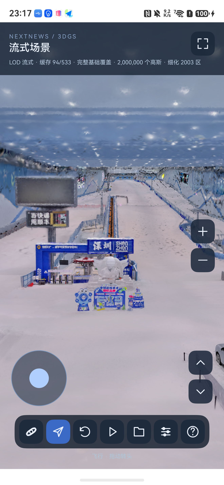

# SOG GPU 编码页、真机 Web 对照与多点触控

这是稳定 GPU 页之后的实验批次。兼容路径仍是启动默认值；没有把尚未通过
的性能门槛标为完成。手机是 Mate 80 Pro Max，HarmonyOS 7.0.0.105、API 26、
Maleoon 935 / OpenGL ES 3.2。SDK/IDE 仍为既有 26.0.0.821 配套安装。

## 实现

- 浮点页保留作画质对照。新路径保留 SOG v2 的四元数、尺度、SH0 颜色编码，
  GPU 按分块码表还原协方差和颜色。位置保留 float32，排序和拾取仍在 CPU。
  每个 GPU 高斯从 64 字节降至 32 字节；CPU 源页为 12 字节位置加 12 字节编码。
- 尺度平方和 SH0 的 256 项码表只计算一次，不为每个顶点重复指数运算。
  位置的 16 位量化值也用逐轴 65,536 项查找表还原，保留原有 double 插值、
  `expm1` 和 float32 舍入公式。小文件继续直接计算，避免查找表初始化开销。
- 码表和高斯页分别分配稳定地址，当前场景与待显示场景均受引用保护。
  码表槽重新分配时校验页内码表地址，避免使用旧槽指向的颜色或尺度。
- 解码预读最多两个文件，缓存操作仅由加载线程执行。取消时等待已启动的
  future 回收后才复用取消标记。旧画面继续显示到新页完成上传。
- GPU 上传按物理页地址排序，相邻页合并为一行上传，不触碰驻留页间的空隙。
  每帧上传总额仍不超过 4 MiB，包含码表；热缓存只更新排序地址缓冲。
- CPU LRU 按 vector 实际容量计量，共享码表在同一缓存内只计一次。
  活跃场景、待提交场景、临时解码、容器开销和驱动内存不属于缓存上限。
  编码纹理预留约 512 MiB，码表约 4 MiB；若还使用浮点对照纹理，它另外保留
  约 512 MiB。因此不能把“每个高斯 32 字节”当作进程总内存。
- 磁盘压力优先回收预取和未使用文件，保留当前及上一视角的源文件。
  两组必需文件可超过 512 MiB 软上限，不因此降低画质。没有空间时暂停可选
  预取，避免反复下载后立即淘汰；这还不是所有 GPU 驻留页的文件引用追踪。
- 800 万仅在“稳定页 + SOG 编码”下开放，且仍为实验档。不会为达标而自动
  降分辨率、降 LOD 或把用户选的 800 万静默改回 400 万。

`PagePrepare`、`PageDecode`、`PageSorted`、`PageGpuReady` 和 `PageDisplay`
都带选择提交版本，分别覆盖排队、文件解码、排序、上传和 EGL 首次成功交换。
配合 ArkTS 的 `StreamTarget`、`StreamFile`、`StreamSelection` 关联镜头与文件。
这些记录不等于物理面板扫描时间，GPU-ready 也表示有序提交完成，而非 GPU fence。

## 可复现命令

```bash
bash scripts/harmonyos/build.sh
bash scripts/harmonyos/debug-build.sh
# 以下命令在 bash 中执行，避免把工具路径写入全局 shell。
source scripts/harmonyos/env.sh
python3 scripts/harmonyos/prepare_comparison.py .local/sog-huafa \
  --splat-transform /Users/szmg/Documents/splat-transform/bin/cli.mjs
bash scripts/harmonyos/serve_stream.sh .local/sog-huafa 8768 --background
hdc rport tcp:8768 tcp:8768
python3 scripts/harmonyos/benchmark_pages.py --encoded --continuous \
  --budget 2000000 --out artifacts/harmonyos/my-2m-hot
python3 scripts/harmonyos/benchmark_pages.py --encoded --file-only \
  --out artifacts/harmonyos/my-2m-file
python3 scripts/harmonyos/benchmark_pages.py --encoded --continuous \
  --budget 4000000 --out artifacts/harmonyos/my-4m-hot
python3 scripts/harmonyos/benchmark_pages.py --encoded --continuous \
  --budget 8000000 --out artifacts/harmonyos/my-8m-hot
python3 scripts/harmonyos/benchmark_web.py --budget 2 --out artifacts/harmonyos/my-web-2m
```

先按 `prepare_web_reference.sh` 建立被忽略的参考 checkout；`prepare_comparison.py`
只给它加固定画布尺寸的测试入口并重建，不改用户另一个 SuperSplat 工程。
转换写独立 PLY 和 provenance，不覆盖原始 SOG 或原始 viewer-settings.json。
输出目录必须不存在，避免用后一次结果覆盖前一次实验。

## 比较条件与限制

同一台手机、同一 Huafa SH0 数据、同一 viewer-settings.json 初始位置和目标，
垂直 FOV 75°，渲染尺寸固定为 1320×2623。转向为初始 yaw ±0.65 弧度；
连续轨迹为 yaw +0.65 sin(1.2t)、pitch +0.08 sin(0.7t)，持续 20 秒。
先预热两个方向，再测 20 次转向。连续轨迹期间仍运行 LOD 选择。
原生热缓存/文件缓存转向测试临时关闭可选预取，并记录每次实际收到的网络
payload 字节；连续轨迹恢复正常预取策略。Web 使用其原生缓存/预取策略。
这项设置差异也需保留在对照解释中。

Web 参考固定为 SuperSplat Viewer 1.31.2 / PlayCanvas 2.22.1，提交
[`96f62515`](https://github.com/playcanvas/supersplat-viewer/tree/96f62515b99a28a20579041a656f7b1911c2964c)。
使用手机 ArkWeb 7.0.0.105 / Chromium 144、WebGL2，关闭额外效果和高精度目标。
不修改其 LOD 选择、纹理管理或排序实现。

Web 以引擎 `frame:ready` 且 loading=0、经过绘制为就绪；收到 false 就绪事件时
清除旧状态。原生要求当前预算下目标集合全部就绪、实际数量匹配且提交版本
已显示。两者选择集合不同，Web 的 CPU/GPU/浏览器文件缓存也未分层隔离。
因此下表是同条件的阶段性观测，不能宣称所有场景原生都优于 Web。

最终结果（每项 20 次，原生三档网络 payload 和高斯页上传均为零）：

| 原生条件 | 目标细节恢复 P95 | 连续帧间隔 P95 |
|---|---:|---:|
| 200 万 GPU 热缓存 | 312 ms | 30.4 ms |
| 400 万 GPU 热缓存 | 555 ms | 56.6 ms |
| 800 万 GPU 热缓存 | 985 ms | 149.0 ms |
| 200 万仅 SOG 文件缓存 | 3479 ms | 未测 |

计划中的 250 ms / 1500 ms / 500 ms 和 400 万连续 50 ms 门槛均未通过。
文件缓存 P95 相比本批早期单解码逐页上传的 6612 ms 降至 3479 ms。
800 万早期虽然高斯页上传为零，上层却仍等待文件；保留相邻视角文件后，
从 3059 ms 降至 985 ms，并明确验证了本次无网络 payload。
这些是顺序开发采样，没有热状态随机化，不把差值解释为独立部件的精确贡献。

包含 Web 的完整表格见 [results.md](evidence/encoded-pages-20260914/results.md)，
逐次数据和去除身份信息的时间线见 [evidence/encoded-pages-20260914](evidence/encoded-pages-20260914)。
未完成的 6 次原生转向采样及早期 Web 测量不用于 20 次验收。

## 画质与华为原生

同源 `chunk-0008.sog`：524,598 个高斯，SHA-256：
`788e478f94121c5a349244e5ee53a8744ce7fec0ae9dca98b087f0bd0b4b3cea`。
独立 splat-transform → SH0 PLY 转换保留全部高斯，输出 SHA-256：
`a7cbb5fd4dd19438bc2ba06b0547774ce8c1db8ed1bd32e6e7c2fe875b74844b`。

ASan/UBSan 对这 524,598 个高斯逐个比较编码和浮点解码，位置、颜色、协方差、
Rz180 一致。与独立 PLY 的最大位置误差约 3.05e-5、颜色误差 1e-6、相对协方差
误差约 2.94e-6。最终手机编码/浮点固定视角 ROI 的 8 位像素最大差为 1，
平均绝对差约 0.000145，99 百分位差为 0。



华为 `loadGSNode` 使用同一单块本地 SOG、Rz180、单位缩放、同一相机和裁剪面。
它在本次实机显示几何但颜色灰褐；同数量 PLY 路径恢复颜色，形状和朝向对应。
这个对照将问题缩小到 SOG 输入处理路径，尚不能认定具体格式字段或引擎缺陷。
背景/颜色处理也还未完全统一；接口返回时间不能作为首帧或同画质 FPS。

`loadTiledGSNode` 继续单列：先前调用成功但未观察到有效分块请求/多块显示，
不计作完成。第一现场最初 `loadGSNode` 的日志同样不能证明后续没有内部 LOD。
官方接口参考：[SpatialRender](https://developer.huawei.com/consumer/cn/doc/harmonyos-references/spatial-recon-spatialrender)。

## 多点触控与回归

右手先按住视角区域、左手再按摇杆，以及相反到达顺序都已在实机验证。
摇杆保存自己的 touch ID，只由该 ID 的位置、抬起和取消驱动；其他手指不会
被接管为摇杆触点。组合操作后抑制误触发单击聚焦，窗口失焦/后台/模式切换
清空所有控制状态。证据见上一批 [multitouch.json](evidence/stable-pages-20260914/multitouch.json)。

本批回归涵盖指针重排、独立抬起、取消、环绕/飞行、配置动画、损坏 SOG、
码表共享计量、LRU 活跃引用、稳定槽和双解码队列。Native/ArkTS 在 3,443 个
叶节点、12 个镜头/预算组合（含 800 万）选择结果一致。
最终安装包又做了三次 Home→前台循环，均恢复 200 万场景；固定视角 ROI
像素差为 0。该测试没有模拟强制表面销毁或内存压力。

## 保留的问题

- 稳定页、GPU 编码和原生选择已经接入；完整独立的网络→分块注册→解码→上传
  调度器仍未完成。目前网络最多四请求，Native 以选择提交启动两文件预读。
- 源 SOG 仍先解码整个文件，随后只保留需要的页；文件缓存冷解码继续有成本。
- 还没有跨所有场景的磁盘缓存总额控制；重启命中时主要校验文件大小，新下载
  才校验 SHA-256。损坏缓存自动逐出与重取仍需补齐。
- Web 与原生的层级分配、帧就绪判据不相同；尚未逐帧实现 SuperSplat 的预算
  反馈和桶调节。单块华为结果不能混入整场流式 FPS 表。
- 20 次网络冷启动、完整的内存压力/窗口重建长期循环、华为原生流式与同轨迹
  性能测量尚未全部验收。进程内存快照不代表峰值或长期没有泄漏。

## 测量中发现的错误

1. 最初 Web 脚本每帧调用 `setResolution`，与上游 resize 互相触发画布重建。
   该组 641 ms / 231.9 ms 结果作废；改为尺寸变化时才设置画布。
2. Web 旧 ready 状态可能跨过后续 not-ready 事件，修复后重测；使用带
   `web-reference-captured-*` 标识的结果，不挑选更好看的早期数字。
3. 连续帧日志会覆盖手机 hilog 环形缓冲里的早期转向记录。采集脚本已在每次
   轮询时累积去重，保持两个阶段的记录；只剩 6 次的旧采样不作验收。Web 也重跑并保存了各 20 次逐次明细。
