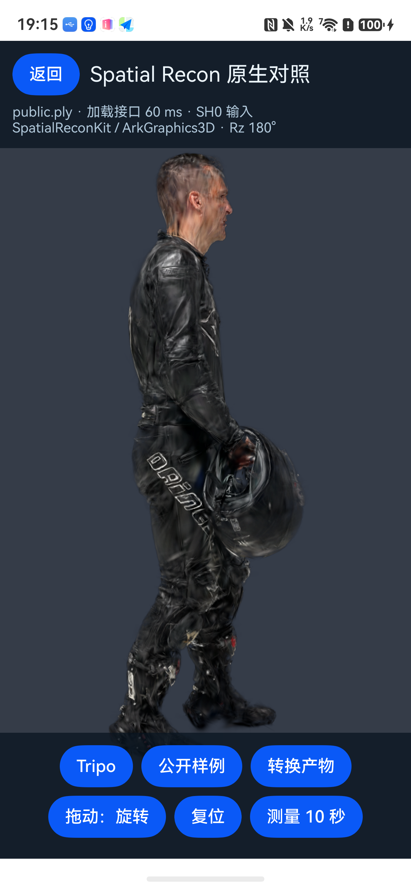
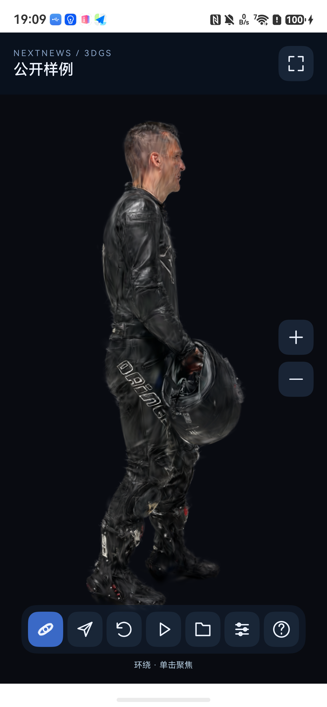
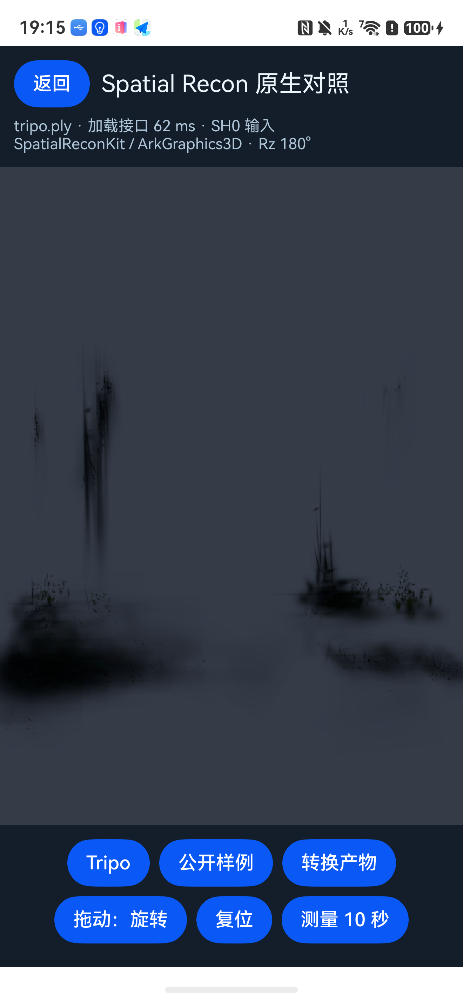
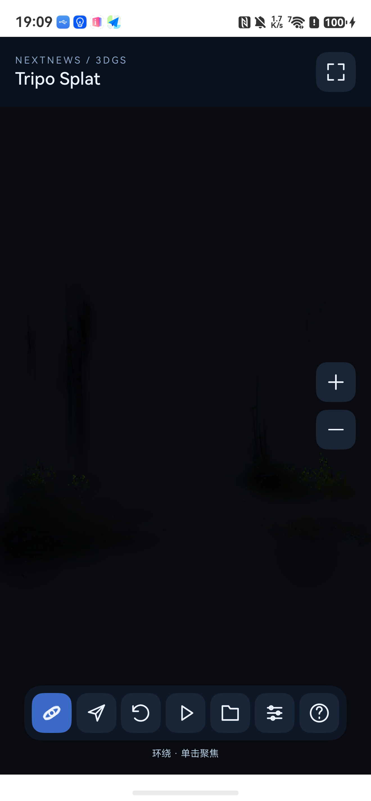
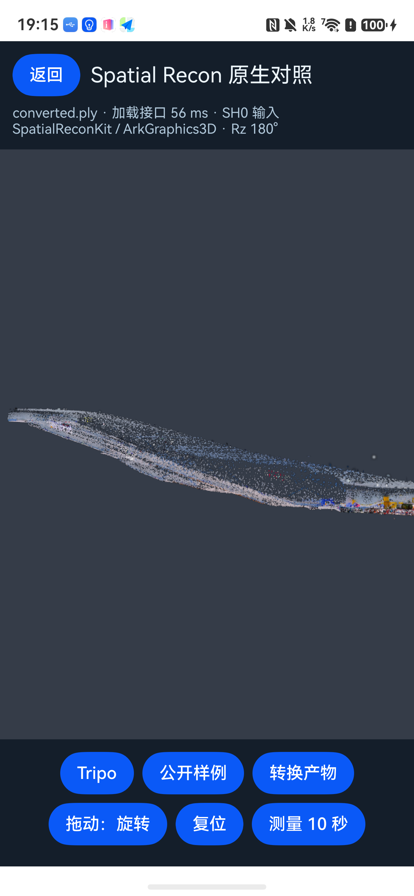
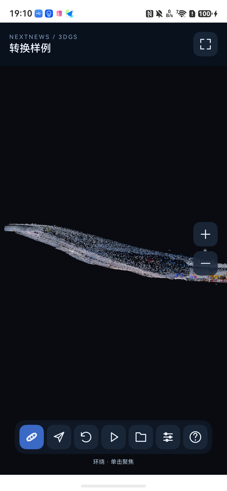

# SpatialReconKit 与 OpenGL 真机对比 — 2026-09-14

已在 **HUAWEI Mate 80 Pro Max / HarmonyOS API 26 Release / Maleoon 935** 上运行两条原生路径。应用的「模型 → 华为原生渲染」进入 SpatialReconKit / ArkGraphics3D 页面，「返回」回到 C++ / OpenGL ES 查看器。三份相同 PLY 均能显示；本轮小模型在稳定区间均约 60 fps，不能据此断言哪套引擎吞吐更高。

此前模拟器在 `Scene.load()` 初始化失败；本机连接的实机通过上下文、插件、场景、模型、相机和实际截图验证。旧模拟器结果见 [排查记录](spatial-investigation.md)，不再作为真机不可用的依据。

## 实现及官方资料

按用户提供的[3DGS 加载指南](https://developer.huawei.com/consumer/cn/doc/harmonyos-guides/spatial-recon-load)，使用：

1. `Scene.getDefaultRenderContext()` 与 `loadPlugin(GSPlugin.PLUGIN_ID)`。
2. `Scene.load()`、`GSPlugin.loadGSNode()`，读取与 OpenGL 完全相同的内置 SH0 PLY。
3. `Component3D` 的 SURFACE 模式、独立相机、45° 垂直视角、相同包围中心和 `radius × 3` 初始距离。
4. 模型四元数 `(x=0,y=0,z=1,w=0)`，即 **绕 Z 轴 180°**；同时变换相机包围中心。这不是相机水平转半圈。
5. 全视口渲染，上下覆盖操作栏；单指旋转、切换平移、双指缩放、复位、固定十秒环绕轨迹。
6. 前后台通知停用相机；恢复时重新挂载场景并保留模型、旋转、平移与缩放。离页取消测量并释放场景。加载失败按上下文／场景／模型／相机阶段报告。

API 支持 PLY、GLB、MP4 不等于所有变种都兼容。本次只验证仓库中三份 PLY。原生重建 C API、AR 放置、API 26 的 tiled GS 接口是不同能力；没有把它们或端侧 SOG 支持冒充为已完成。飞行、焦点拾取、图标工具栏和 SOG 流式目前仍在 C++ 路径中。

## 本轮修复的问题

仅更新 `@State scene` 时，Component3D 曾保留旧人物画面，即使加载提示已经切到 Tripo；返回的 Promise 不代表新场景已显示。现先清空组件场景并让 UI 提交卸载，再销毁旧场景并挂载新场景。重新截图确认三种模型确实不同。存在旧画面的初轮性能数据已排除。

实机 Home → 返回时，仅启用相机曾出现模型消失、背景仍在的问题。改为重载所选模型并恢复相机参数后，已取得[恢复画面](evidence/spatial-device-20260914/resumed.png)。单指旋转、平移、复位、返回 OpenGL 后再次进入也有截图验证；双指缩放已实现，但本轮没有完成真机多指注入测试。

加载提示改称「加载接口」：60／62／56 ms 包括本次卸载等待和初始化，**不是首帧时间**，也不能直接和 OpenGL 的解析耗时比较。

签名刷新遇到 TLS `ECONNRESET`，使用刚为该手机生成的有效本地签名完成构建和安装；没有关闭证书验证。签名、账号、设备序列号和原始诊断日志均保留在忽略目录。

## 相同输入与测量结果

两条路径的 RenderService 表面边界均为 **1320 × 2623**。轨迹为 `yaw=0.3×秒数`、`pitch=0.2`、`zoom=1`、目标点为包围中心，持续十秒。模型原始字节相同，输入数量及 SHA-256 记录在 [measurements.json](evidence/spatial-device-20260914/measurements.json)。华为引擎内部实际绘制数量未由公开接口测出。

| 输入 | 数量 | 华为路径稳定记录频率 | OpenGL 稳定记录频率 | 全进程 PSS：华为 / OpenGL |
|---|---:|---:|---:|---:|
| 公开人物 | 80,000 | 60.06 Hz | 60.06 Hz | 245.7 / 96.5 MiB |
| Tripo 本地输出 | 32,768 | 60.05 Hz | 60.06 Hz | 247.3 / 142.9 MiB |
| splat-transform 转换样例 | 80,000 | 60.05 Hz | 60.06 Hz | 251.7 / 161.5 MiB |

这里的稳定频率取轨迹进行约六秒时，`hidumper -s 10 -a "-id <surfaceId> fps"` 返回的最后一秒表面时间记录计算；两列原始时间戳保留在本地，不把它们的差解释为 GPU 耗时。SmartPerf 同时采集十二个一秒窗口，完整 FPS 数组写入 JSON。点击后有短暂 120 Hz 阶段，随后约 60 Hz；本轮不是锁定刷新率的最大吞吐基准。也不把 OpenGL 页面里的 EGL 提交次数当作屏幕呈现帧数。

PSS 为 SmartPerf 全应用进程采样的中位数，包含 UI、驱动、模型及缓存。两条路径按不同序列采集，华为页面也保留了上一页的应用状态；因此它们说明本次运行占用，不能当作引擎独占内存差额。GPU load 是全设备指标，且出现零值，本轮不拿它证明 GPU 利用率优势。260k、2M 或全量 SOG 的同输入华为路径性能尚未测量。

## 实际画面

两条路径的人物朝向、轮廓及主要颜色相近。华为背景仍比 OpenGL 更亮：设置 `BACKGROUND_NONE`、相同 `clearColor` 和 `postProcess=null` 后仍存在显示转换差异，不能声称像素级一致。两套输出均可看到 Tripo 模型偏黑、转换模型稀疏；本轮不将这些情况归结为某一引擎的解码故障。

| 输入 | SpatialReconKit | C++ / OpenGL |
|---|---|---|
| 公开人物 |  |  |
| Tripo |  |  |
| 转换样例 |  |  |

## 复现与交付

```bash
bash scripts/harmonyos/build.sh
# 已有包含该真机的有效本地签名时，可直接构建签名副本；源码须先同步。
source scripts/harmonyos/env.sh
(cd .local/signed-harmonyos/apps/harmonyos && devecocli build && devecocli run --skip-build)
python3 scripts/harmonyos/compare_renderers.py
```

测试脚本会重启此调试应用，按两条路径依次选择三份输入，保存实际截图、树、SmartPerf 和表面帧记录。多设备时传 `--device`，可用 `--backend gl` 或 `--backend spatial` 单独采集。输出目录必须新建，避免覆盖证据。首次设备签名请按 README 的 `debug-build.sh` 流程完成。

本轮使用既有 DevEco Studio 26.0.0.821、API 26 SDK、CLI 1.3.0-stable；未变更全局开发环境。调试包位于忽略的 `artifacts/harmonyos/NextNews-debug.hap`，归档副本为 `artifacts/harmonyos/spatial-device-20260914/NextNews-dual-renderer-debug.hap`。已成功构建并安装到实机；本次没有修改 C++ 解析或数学代码，因此未重复主机核心测试。
