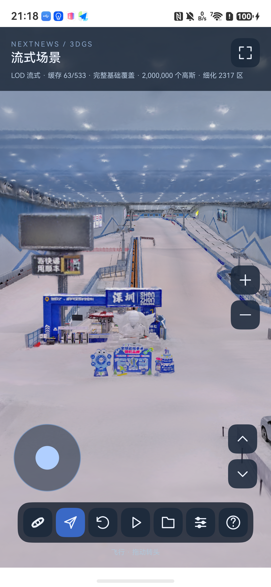

# Stable GPU pages: implementation and staged measurements

This is an experimental route. The compatibility `chunks()` route remains the
startup default. This report covers the first float-page batch. Follow-up SOG
GPU decoding, 4M/8M experiments and same-phone Web comparison are recorded in
[encoded-pages-20260914.md](encoded-pages-20260914.md). The complete acceptance
matrix must not be inferred from these intermediate results.

## Implementation

- Source identity plus a 256-Gaussian source-page number determines a stable GPU
  slot. Selection changes retain existing page addresses. The current draw and
  incoming selection are both pinned; failed allocation leaves the current draw
  intact. Nonreferenced pages are evicted by LRU.
- Selected scenes retain references to source pages and copy only positions and
  addresses. They no longer assemble a complete color/covariance array or repack
  the entire selected texture. Sorting maps logical indices to GPU addresses.
- The float RGBA32F path uploads at most 256 pages (4 MiB) per frame. The old scene
  remains visible until the incoming pages are ready. GPU-hot selections upload
  no Gaussian pages; the sorted address buffer still changes.
- Parser/selection preparation and sorting run off ArkUI. Each owns its sorting
  workspace. CPU cache limits charge allocated vector bytes: decoded files
  256 MiB, legacy selections 256 MiB, source pages 384 MiB. Active shared owners
  can outlive LRU eviction; those limits are not a total process-memory cap.
- Generated manifests now retain the original leaf AABBs and per-SOG SHA-256.
  Selection uses closest-point distance, min-axis FOV compensation and a gradual
  rear penalty of up to 5, with a strict draw budget. This replaces the previous
  outside-frustum-to-coarsest rule. A single near/far ordering replaces repeated
  importance sorts. An adjacent finer level is prefetched after desired files.
- These rules follow the local PlayCanvas 2.17.1 reference's distance and fallback
  mechanisms. Its bucket balancer and adaptive budget-scale feedback are not
  identically reproduced; matching point budgets alone does not establish parity.
- Network concurrency remains at most four; this initial batch used one native
  decoder (the follow-up adds bounded two-file prefetch). Hashed manifests use persistent local
  files, validated before atomic rename. Manifests without hashes use temporary
  sessions. No user source files or viewer-settings.json are modified.

## Measurement definition

`StreamTarget` records camera/selection timing, `StreamSelection` links the
current target and coverage to a native submission revision, and `PageDisplay`
records the first successful EGL swap of that revision. `refineMs` is native
submission-to-swap, not the full camera-to-detail delay or physical panel scanout.
`StreamTrial.elapsedMs` includes selection and a 20 ms completion poll; it is a
conservative end-to-end upper bound. A trial completes only after target coverage
is 1, actual draw count matches the target, and the latest submitted revision
has reached the display boundary. No LOD reduction is used to meet the timing.

`benchmark_pages.py` makes two warm-up turns, then 20 identical alternating poses
(+/-0.65 radians from the supplied initial camera). It records all uploads so a
non-hot trial cannot be silently counted as GPU-hot. Continuous-interaction frame
time is a separate check. These initial runs did not measure it; the later
`--continuous` option records a separate 20-second camera trajectory.

```bash
source scripts/harmonyos/env.sh
python3 scripts/harmonyos/benchmark_pages.py --out artifacts/harmonyos/pages-2m
python3 scripts/harmonyos/benchmark_pages.py --budget 4000000 --out artifacts/harmonyos/pages-4m
python3 scripts/harmonyos/benchmark_pages.py --file-only --out artifacts/harmonyos/pages-file-only
```

File-only trials retain the previous drawable scene but clear reusable CPU
resources and assign a fresh source-identity epoch for the target. Thus the
incoming target cannot reuse old GPU pages; files remain cached. These are not
network-cold trials and do not simulate OS filesystem-cache eviction.

## Phone evidence so far

Mate 80 Pro Max, HarmonyOS 7.0.0.105, API 26, Maleoon 935, OpenGL ES 3.2.
Native viewport 1320 x 2623; SH0, viewer-settings default camera, vertical FOV75.

| Intermediate build | Trials | Camera-to-detail P95 | Native submit-to-swap P95 | Gaussian uploads |
|---|---:|---:|---:|---|
| Initial stable pages, old selector | 20 | 358 ms | 187.05 ms | zero in all 20 |
| AABB distance selector | 20 | 270 ms | 178.08 ms | zero in all 20 |

Both trials retained complete target coverage around two million drawn Gaussians.
The **250 ms end-to-end gate has not yet passed** in these measurements. These
are sequential development measurements, not thermally controlled A/B results.
Later experiments and the final verified build are recorded in the work log.



## Failures retained in the record

A typed-array N-API experiment read an invalid range value and originally escaped
from the ArkTS timer, causing a JS crash. It was replaced with an explicit
ArrayBuffer copy and a caught submission error. Subsequent phone runs completed
20 turns with full coverage and zero data uploads. This is an observed difference
between the two implementations, not a proven diagnosis of an OS defect.

A three-pass, 11-bit radix experiment was slower on the phone than expected and
was not retained. Four 8-bit passes and separate per-thread scratch buffers remain.

## Native Huawei baseline

The independent single-SOG entry reads `chunk-0008.sog` through `loadGSNode` from
an app-local file. OpenGL reads the same SHA-256-checked file. Both use Rz180,
unit model scale, the same scene bounds and viewer-settings camera/FOV. This
separates the single-block baseline from the unfinished native tiled adapter.

FirstScene's initial-load logs for sky-art-mana-1, SZMG_3L_lod and SZMG_6L_lod
show local `lod-meta.json` followed by one SOG (`4_0.sog`, `4_0.sog`, `3_0.sog`)
and `loadGSNode`, Rx180 and scale3. They do not establish what happens later
inside the renderer. Detail changes during movement may include internal
selection, projection or occlusion; no conclusion of “no LOD” is justified.

The next selector implementation registers the AABBs/ranges once and evaluates
them in native C++. Differential tests compare all 3,443 leaves across eight
pose/budget combinations against the ArkTS implementation. On-phone selection
now takes approximately 1–4 ms in the captured target logs. Loader/sorter threads
request user-initiated QoS; EGL requests interactive QoS using the public API.
These changes alone do not establish the 250 ms gate; full pipeline measurements
remain authoritative. New camera targets can cancel an obsolete pending selection;
new files for the same target wait for its existing submission to finish.
