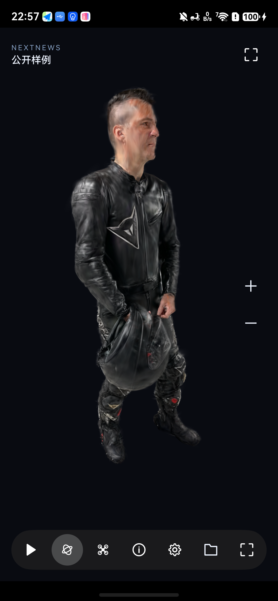
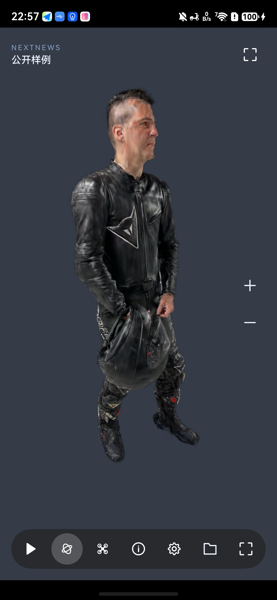
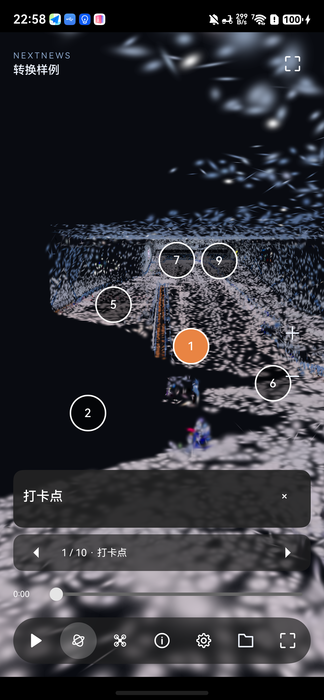
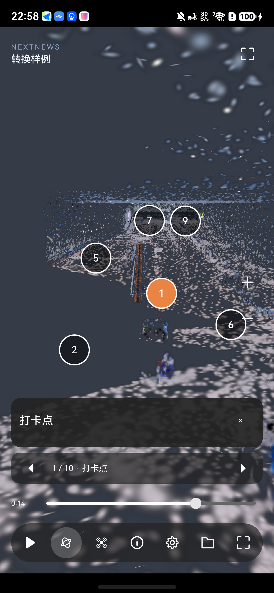

# 共用 Viewer 第一批预览 · 2026-09-15

状态：**部分实现，预览版本；不是完整 SuperSplat 体验验收通过。**

## 接续依据

资源兼容任务“规划鸿蒙端 SOG 资源兼容方案”已结束，接续主分支的
`01eac16`。资源任务在独立工作树 `.local/worktrees/asset-conversion`，结论提交
`1476d45`，没有混入 Viewer 分支。

[资源兼容结论](https://github.com/Shuang-su/NextNews/issues/1#issuecomment-5681724704)：
Mate 80 Pro Max 上有效 PLY、Remy GLB、提取正确内嵌 GLB 的 MP4 可显示；
GSEdit 句柄不证明编辑生效，三次 180 秒 saveToPLY 没有文件或回调。
这些限制保留，不能据此宣称格式兼容或跨平台导出已完成。

对标固定为 [SuperSplat Viewer v1.31.2](https://github.com/playcanvas/supersplat-viewer/tree/96f62515b99a28a20579041a656f7b1911c2964c)。
本机参考在忽略目录 `.local/supersplat-viewer-reference`，已有 MetaFlow 工程不改写。

## 本次实现

- `ViewerRuntime` 管理两后端共用的世界坐标镜头、动画、标注、过渡与输入状态。
  单体 PLY/SOG 可通过 `ViewerBackend` 切换 OpenGL / SpatialReconKit；保留镜头、
  模式、所选标注、播放时间。原生瓦片入口仍独立实验。
- 官方 MIT 图标、底部工具栏、标注开关/前后导航、编号热点/标题/正文、播放暂停与
  时间轴。工具按钮 44 vp；模型、配置导入及后端对照在扩展菜单。
- `viewer-settings.json` 旧版迁移，空镜头按实际边界取景；相机/标注不重复旋转。
  保留模型 Rz(180°)。支持 step 轨道、单关键帧、循环/往返时间映射。
  背景、声音、色调映射、后处理字段可解析保留，**尚未接入渲染/播放**。
- 普通环绕轻点聚焦，普通飞行轻点前往；双点聚焦并进入环绕；游戏控制不点击导航。
  原有独立触点归属保留；完整官方第一人称/手柄映射属于后续批次。
- 后台暂停输入和流式请求；华为场景前台恢复时重建，并恢复镜头及 UI 状态。
- 修复相反镜头过渡时 eye/target 可能重合，导入模型异步读取实际边界，避免沿用旧范围。

## 验证方法与证据

设备：Mate 80 Pro Max / SGT-AL10，API 26，
SGT-AL10 7.0.0.105(SP10C00E105R3P3)。屏幕 1320×2848。
设备编号、原始日志和签名材料只保留在忽略目录。

构建继续使用现有 DevEco Studio 26.0.0.821、配套 SDK 与 `build.sh`。
本地预览包：`artifacts/harmonyos/NextNews-viewer-preview.hap`；旧
`NextNews-debug.hap` 保留。预览包没有更改稳定页/编码纹理的实验状态。

```bash
bash scripts/harmonyos/build.sh
node scripts/harmonyos/test_viewer_runtime.cjs
node scripts/harmonyos/test_viewer_settings.cjs
node scripts/harmonyos/test_pointer_input.cjs
node scripts/harmonyos/test_orbit.cjs
node scripts/harmonyos/test_stream.cjs
DEVELOPER_DIR=/Applications/Xcode-27.0.0-beta.5.app/Contents/Developer python3 scripts/harmonyos/test_core.py
# 真机 UI / 生命周期（仅一台连接；会重启这个调试 App）
bash -c 'source scripts/harmonyos/env.sh; python3 scripts/harmonyos/verify_viewer_common.py --out artifacts/harmonyos/viewer-new-run'
```

配置/数学/触点/流式测试和 ASan+UBSan 主机核心测试通过。主机测试不作为显示证据。
实际真机捕获包括：同一公开模型两后端显示、华发 10 个标注的导航、时间轴拖动、
播放暂停、后端切换、Home 后返回、游戏模式摇杆。

原始证据：`artifacts/harmonyos/viewer-20260915/final-smoke/`。
已人工查看标注/华为恢复/游戏控制图片；图中转换样例是 80k **功能测试数据**，
不是整场流式画质或性能证明。OpenGL 标注与 Huawei 标注截图的动画时间不同，
不能作为严格同镜头 A/B；公开静态模型截图才是同镜头切换对照。

首次脚本在所有 UI 步骤后读取 hilog 遇到非 UTF-8 字节，已保留原始字节并修复日志解码。
另一次重跑遇到 UI 控件定位失败，该次不计通过。重装最新 HAP 后的独立证据见
`artifacts/harmonyos/viewer-20260915/release-smoke/`，最终结果另行追加。

## 功能矩阵与后续门槛

| 项目 | OpenGL | 华为原生 |
|---|---|---|
| 同源单体模型 + 共用镜头/UI | 真机显示 | 真机显示；背景偏灰，未等价 |
| 10 标注、导航、播放/拖动时间轴 | 功能预览通过 | 功能预览通过 |
| 标注遮挡、官方锚定弹窗 | 未完成 | 未完成 |
| 点选精确度 | 既有高斯拾取 | SDK raycast 已接入，GS 命中准确度未通过 |
| 整场流式 | 既有路径，实验页架构保留 | 未通过，不允许由切换接口假装成功 |
| 完整官方鼠标/键盘/手柄 | 部分 | 共用控制，部分 |
| 步行、GLB/单体/分块体素碰撞 | 待接入共用原生模块 | 同左 |
| 天空盒/音频/高阶 SH/后处理 | 字段解析或未实现 | 能力未实测，不能宣称等价 |
| 2M/4M/8M 性能门槛 | 本批未重新测量 | 本批未测量 |

本批没有降低画质/分辨率以达标，没有将 80k 预览视作 2M 流式。
后续保留每条件至少 20 次、GPU 热缓存与文件缓存分开的测量要求。
分块碰撞必须使用真实 32 块清单；39 块规划清单不可用于运行验收。

## 最终预览复核

22:57–22:59 的 `release-smoke` 完整通过。人工复核公开模型 OpenGL/Huawei
均正常直立、构图一致；标注导航正常，华为后台返回后模型与标注恢复。
主包 SHA-256：`1c2c6aaaac142e715c7b32d29f462b326f8ca7baa298e7a4a4b2b973a8c1e797`。

| 静态同镜头 OpenGL | 静态同镜头 Huawei |
|---|---|
|  |  |

标注预览（80k 功能样例，非全场画质）：




